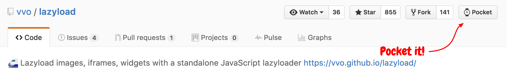
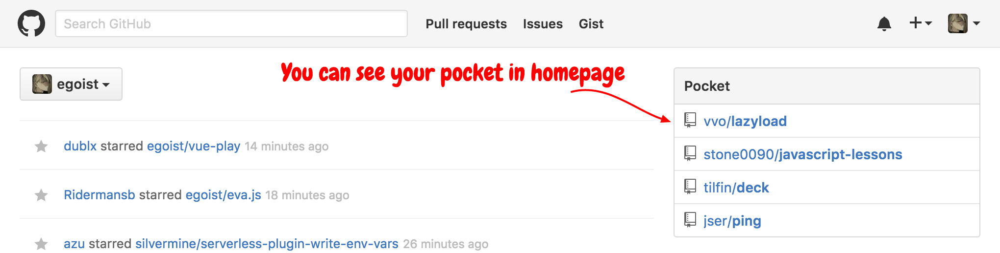

# GitHub Pocket

Ahhhhh, sometimes I don't want to star a repo, I just have no time to know if it's really interesting, but it looks it is! I don't want to miss good stuff either. So I just add it to pocket and read it later!

## Pocket it



## View your pocket



## Install

### From Chrome Web Store
You can install the extension [here](https://chrome.google.com/webstore/detail/github-pocket/cfkoiggmhiohdhpkcpinclakhcodmdal).

### [Manuall install](http://superuser.com/questions/247651/how-does-one-install-an-extension-for-chrome-browser-from-the-local-file-system/247654#247654):

```
Navigate to chrome://extensions
Expand the developer dropdown menu and click "Load Unpacked Extension"
Navigate to local folder
Assuming there are no errors, the extension should load into your browser
```

## License

[MIT](http://egoist.mit-license.org) &copy; [EGOIST](https://github.com/egoist)
